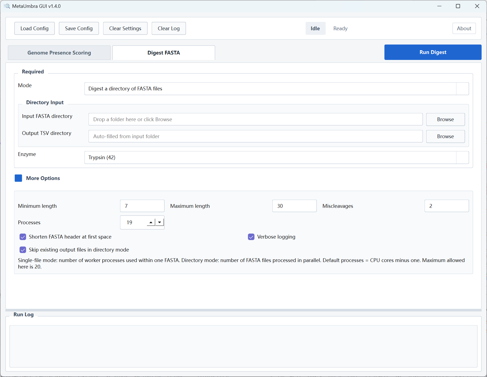
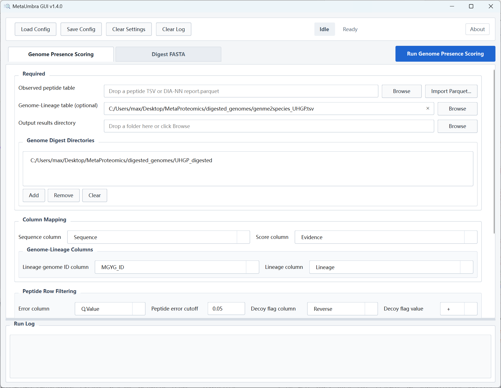
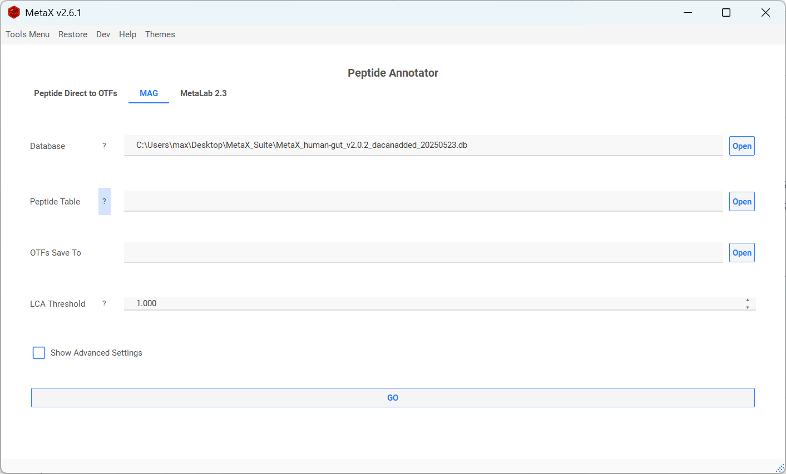
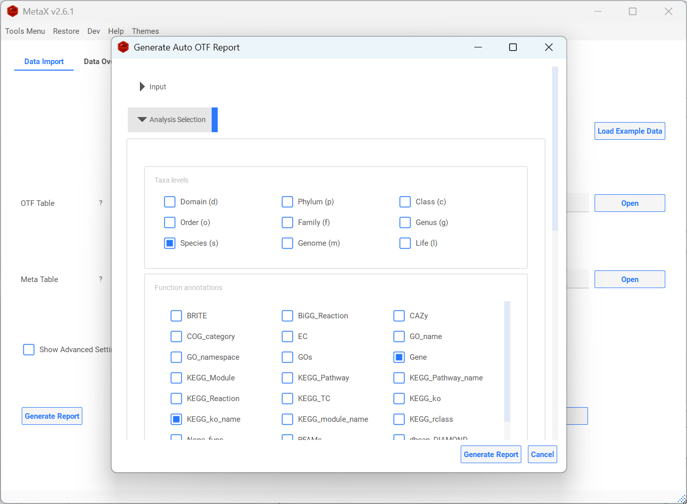

# MetaX Cookbook

This cookbook is the practical user guide for the MetaX desktop application. It covers peptide-to-OTF annotation, OTF analysis, visualization, automated reports, and reproducible workflow export. Command-line workflows are introduced where they complement the GUI, with installation, annotation, reporting, database-building, and automation details collected in the [MetaX CLI](#metax-cli) tab on the same deployed page.

## Overview

**[MetaX](https://github.com/byemaxx/MetaX)** links peptide sequences with taxonomic and functional information in **metaproteomics**. The **Operational Taxon-Function (OTF)** framework is designed to investigate “who is doing what and how” within microbial communities.

MetaX provides peptide annotation, quantitative summarization, statistical testing, visualization, automated HTML reports, and exportable analysis workflows for peptides, proteins, taxa, functions, and taxon-function associations.


Project resources: [GitHub repository](https://github.com/byemaxx/MetaX) · [MetaX CLI](#metax-cli) · [Change log](https://github.com/byemaxx/MetaX/blob/main/Docs/ChangeLog.md)

## Contents

- [Getting Started](#getting-started)
- [Module 1. OTF Analyzer](#module-1-otf-analyzer)
- [Module 2. Database Builder](#module-2-database-builder)
- [Module 3. Database Updater](#module-3-database-updater)
- [Module 4. Peptide Annotator](#module-4-peptide-annotator)
- [Reporting and Reproducibility](#reporting-and-reproducibility)
- [Application Tools](#application-tools)
- [Support](#support)

## Getting Started

The main window opens on the OTF Analyzer. Use **Tools Menu** to switch between the Analyzer, Database Builder, Database Updater, and Peptide Annotator.


Choose the shortest route for your data:

1. **You already have an OTF table:** Continue with [Module 1. OTF Analyzer](#module-1-otf-analyzer).
2. **You have a peptide-intensity table from a MAG search:** Build or select the matching annotation resources, then use [Peptide Direct to OTFs](#1-peptide-direct-to-otfs-recommended).
3. **Your peptide table already contains protein assignments:** Use the [MAG annotation tab](#2-mag-annotate-a-pre-mapped-peptide-table).
4. **You have MetaLab 2.3 MaxQuant results:** Use the [MetaLab 2.3 tab](#3-metalab-23-maxquant-results).
5. **You want a standard overview quickly:** Select the OTF and metadata tables in the Analyzer and use **Generate Report**.

## Module 1. OTF Analyzer

After creating an OTF table with the [Peptide Annotator](#module-4-peptide-annotator), use the OTF Analyzer to build quantitative tables, run statistical tests, review results, and create figures.

### 1. Data Preparation

Select the two main inputs:

- **OTF table:** A peptide-level Operational Taxon-Function table produced by the [Peptide Annotator](#module-4-peptide-annotator) or a compatible external workflow.
- **Metadata table:** The first column contains sample IDs; the remaining columns contain grouping variables such as subject, treatment, site, or batch. Sample IDs must match the OTF intensity-column names after removal of the configured sample prefix. If no metadata table is supplied, MetaX can generate simple grouping information automatically.

**Example Meta Table:**

| samples  | Individuals | Treatment | Sweetener |
| -------- | ----------- | --------- | --------- |
| sample_1 | V1          | Treatment | XYL       |
| sample_2 | V1          | Treatment | XYL       |
| sample_3 | V1          | Treatment | XYL       |
| sample_4 | V1          | Control   | PBS       |
| sample_5 | V1          | Control   | PBS       |
| sample_6 | V1          | Control   | PBS       |

Use **Load Example** to explore the Analyzer with the bundled example data.


Click **GO** to load the data. Use **Generate Report** instead when you want the automated HTML workflow described in [Auto OTF Report](#auto-otf-report).

**Advanced Settings**


- **Peptide Column Name:** Column containing the biological peptide sequence.
- **Protein Column Name:** Protein-group column used when a protein intensity table is requested.
- **Sample Column Prefix:** Prefix used to recognize intensity columns.
- **Any Data Mode:** Loads a non-OTF quantitative table with a reduced set of analysis tools.
- **Customized Table Item Column Name:** Item identifier for Any Data Mode; when blank, MetaX uses the first column.

### 2. Data Overview

Data Overview summarizes the numbers of peptides, taxa, functions, and linked taxon-function entries. Use its thresholds to focus the overview plots on supported links.


Select a function annotation to inspect its proportion distribution.


You can exclude samples here before building downstream analysis tables.


Click **Export Meta Table for Editing** to save the currently loaded metadata as a TSV file. This is useful after MetaX has generated default metadata or when you want to edit the sample grouping and reload it for a later analysis.

### 3. Build Analysis Tables (Set TaxaFunc)


#### Data Selection

- **Function:** Select the function annotation used in downstream tables. Select **None** to work only with peptides and taxa.

- **Function Filter Threshold:** Minimum within-protein-group proportion required to retain a function assignment for a peptide. The default is `1.00` (100%).


- **Taxa Level:** Select the taxonomic level used for aggregation. **Life** disables taxonomic-level filtering and is useful for function-only analysis.

- **Peptide Number Threshold:** Retain taxa, functions, or taxon-function entries supported by at least this number of unique biological peptide sequences.

- **Split Function:** Expand multi-value function annotations into separate rows. For example:

  | KO                  | Intensity |
  | ------------------- | --------- |
  | ko:K00625,ko:K13788 | 10        |

  becomes:

  | KO        | Intensity |
  | --------- | --------- |
  | ko:K00625 | 10        |
  | ko:K13788 | 10        |

  With **Share Intensity** enabled, the original intensity is divided equally, giving `5` to each KO in this example. Without it, each expanded row retains the original value.

- **Remove unknown taxa:** Checked by default. When enabled, peptides that are not annotated to the selected taxonomic level will be removed. When unchecked, such peptides will be retained and labeled as *unknown*, for example:

    ```text
    d__Bacteria;p__Firmicutes_A;c__Clostridia;o__Oscillospirales;f__Ruminococcaceae;g__UMGS363;s_
    ```

    to

    ```text
    d__Bacteria;p__Firmicutes_A;c__Clostridia;o__Oscillospirales;f__Ruminococcaceae;g__UMGS363;s_unknown
    ```

- **Create Taxa and Func only from OTFs:** When disabled, the Taxa and Function tables apply their own independent filters. When enabled, both tables are derived from the peptide rows that pass the combined taxonomic and functional OTF filters. The Taxa-Function table always uses both filters.

#### Generate a Protein Intensity Table

Enable **Generate Protein Intensity Table** when the input OTF includes a protein-group column.

- **Occam's Razor:** Builds a minimal protein set that covers the observed peptides, then assigns a shared peptide to the best-supported protein. Tied proteins share its intensity.
- **Anti-Razor:** Retains every linked protein and shares the peptide intensity across them.
- **Rank:** Assigns shared peptides to the higher-ranked protein. Ranking can use unique-peptide counts, all-peptide counts, unique-peptide intensity, or shared-peptide intensity.
- **Minimum peptide number per protein:** Removes proteins supported by fewer peptides than the selected threshold.

#### Data Preprocessing

- **Quantitative method:** Use **Sum** to aggregate peptide intensities directly, or **DirectLFQ** to estimate abundance from normalized intensity traces.

- **Outlier detection:** Selected values are marked as `NaN`; rows containing only zero/`NaN` values are then removed. Detection and imputation can use different metadata columns.
  - **IQR:** Marks values outside `Q1 - 1.5 × IQR` and `Q3 + 1.5 × IQR`.
  - **Missing-Value:** Passes existing missing values to the handling step.
  - **Half-Zero:** Within each group, converts the minority state (zero or non-zero) to `NaN`; an equal split converts the whole group.
  - **Zero-Dominant:** If zeros form the majority of a group, marks its non-zero values as `NaN`; otherwise leaves the group unchanged.
  - **Zero-Inflated Poisson / Negative Binomial:** Uses a fitted count model to identify improbable values.
  - **Z-Score:** Detects values far from the group mean in standard-deviation units.
  - **Mahalanobis Distance:** Detects multivariate outliers while accounting for correlation between samples.

- **Outlier handling:** Choose **Drop**, **Original**, **Mean**, **Median**, **KNN**, **Regression**, or **Multiple** imputation. Imputation can be performed within groups or across all samples.

- **Remove Batch Effect:** Select the batch metadata column and apply [reComBat](https://github.com/BorgwardtLab/reComBat).

- **Data transformation:** Log2, log10, square root, cube root, or Box-Cox.

- **Data normalization:** Trace shifting, standard scaling (Z-score), min-max scaling, Pareto scaling, mean centering, or percentage normalization. When trace shifting and transformation are both enabled, normalization runs first. MetaX adds a minimum offset after Z-score, mean-centering, or Pareto normalization to avoid negative abundance values.

Drag preprocessing steps to change their execution order.

  

Click **GO** to create the TaxaFunc analysis object.


Use **Table Review** to inspect generated tables. Double-click one table to open it. Use Ctrl/Shift selection and right-click **Export Selected Tables** to export several tables as TSV or CSV files, both of which can be opened in Excel. In an opened table, right-click selected cells to copy or export only the current selection.


### 4. Basic Statistics and Plots

#### PCA, t-SNE, Correlation, and Box Plot


Select a table and analyze all samples, selected samples, or metadata-defined groups. Two-dimensional PCA, interactive 3D PCA, t-SNE, correlation, and box plots are available for Taxa, Function, Taxa-Function, Peptide, and Protein tables when those tables exist. Use t-SNE for exploratory nonlinear separation; its layout depends on the selected perplexity, iteration count, and early-exaggeration settings.


- **Plot controls**

  - Show or hide labels in the figure by checking **Show Labels**.

  - Select **Sub Meta** to combine a second metadata variable with the primary grouping.

    

  - Change labels, dimensions, colors, and other options in **PLOT PARAMETER**.

    

      

  - Enable the condition controls to select groups within a second metadata value.

    For example, compare treatment groups only within `Individual = V1`.

    

  - Switch to sample selection when only specific samples should be plotted.

    

      

    

- **Number statistics**

  - Plot the counts for each table by **groups** or by **samples**.

    

- **Taxa-specific plots**

  - Alpha/Beta Diversity

    
    

  - Sunburst

    

  - Treemap

    

  - Sankey

    

    


#### Heatmap and Bar Plot


Select Taxa, Function, Taxa-Function, Peptide, or Protein items and add them to the plotting list. Use **Add All** only when the resulting figure will remain readable.

The focused item list is shared by more than the heatmap and bar plot buttons:

- **Plot PCA** compares the abundance profiles of only the selected biological items; enable **3D PCA** in its settings when at least three items are available.
- **UpSet** summarizes intersections among the selected items, groups, or samples.
- **Plot Sankey** is available for compatible Taxa and Taxa-Function selections.
- **MetaTree** is available for Taxa and Taxa-Function selections when a MetaTree installation directory has been configured under **Dev > Settings**.
- **Get Table** exports the selected-item matrix used by these plots.


- **Add Top to List:** Rank items by abundance or a completed statistical test and add the selected number of results.

  - **Filter with threshold** uses adjusted p-values for ANOVA/T-test and adjusted p-value plus log2 fold-change thresholds for Limma/DESeq2 results.

  

- **Add a list:** Paste one item per line to build a reusable focus list.


- **Settings:**
  - **Rename Samples:** Add group information to sample labels.
  - **Rename Taxa:** Display only the last populated taxonomic rank.
  - **Plot Mean:** Aggregate samples to group means before plotting.
  - **Sub Meta:** Combine two metadata variables for heatmaps and 3D bar plots.
    
  
  - Right-click **Theme** to preview the available color maps.
    
    
  
- **Heatmap output:**

  

  - Use **Modify** to adjust the figure layout after it opens.

    
    
    


- **Bar Plot:**


- **Interactive bar controls:**

  

  - Change to a line plot:

    

- **3D Bar Plot:** Select a **Sub Meta** to create the second grouping dimension.
  


#### Peptide Query

Select or type an exact peptide sequence to inspect its linked proteins, taxa, functions, and abundance values. Large peptide lists are loaded as a searchable preview; an exact pasted sequence can still be queried.

  


### 5. Statistical Tests

#### T-test

Select two groups to run a T-test on Taxa, Function, Taxa-Function, Peptide, or Protein tables.


#### ANOVA

Select two or more groups to run ANOVA on the available analysis tables.


#### Significant Taxa-Function Results

This comparison highlights discordant taxon-function behavior: a taxon may remain stable while one of its linked functions changes significantly, or a taxon may change while a linked function remains stable.


#### Cross-test Heatmaps

T-test and ANOVA results open in a result window and are also registered in Table Review.

  

  

Choose a result table to plot a top-difference heatmap or export the corresponding top-result table.


- **Taxa-Function cross heatmap:** Colored cells indicate significant taxon-function combinations, with functions on the x-axis and taxa on the y-axis.


- **Function/Taxon heatmap:** Color represents the abundance of significant functions or taxa across groups.

  

- **Significant Taxa-Function heatmap:** Colored tiles represent discordant significance patterns between a taxon and its linked function.

#### Group-vs-Control Tests

Set one group as **Control** to compare every other group against it. **Comparing in Each Condition** repeats those comparisons within the values of another metadata column, such as subject or site.

If the Limma/DESeq2 controls are hidden, open **Help > About** and click **Like** three times to enable the advanced differential-expression pages.


- **Limma** is the default group-vs-control method for log2-style quantitative abundance. Zero values remain numeric by default; enable **Convert zeros to NaN** only when zeros represent missing measurements.
- **DESeq2** is intended for untransformed count-like data. MetaX checks whether earlier preprocessing is compatible before running it.
- Both methods support optional covariates.
- **Dunnett's test** remains available as a legacy group-vs-control method. Its heatmap displays the test statistic.


#### Differential Expression (Limma / DESeq2)

Use this page for a selected pairwise comparison. Choose **Limma** for log2-style quantitative abundance or **DESeq2** for untransformed count-like data. Limma is the default; both methods use the [InMoose](https://github.com/epigenelabs/inmoose) backend.

  


Set the adjusted p-value and log2 fold-change thresholds, then generate a volcano plot or a taxon-function Sankey plot. **Ultra-Up/Down** marks results whose absolute log2 fold change exceeds the configured maximum display threshold.

  - Volcano:

    

  - Sankey:

    - For Taxa-Function results, the final node level contains the functions linked to each taxon.
    - Sankey plotting is available for Limma and DESeq2 Taxa and Taxa-Function result tables.

    

Right-click a supported differential result in Table Review to open the **Differential Results Extractor** or generate a long-format table for downstream filtering, export, or plotting.


#### Tukey Test


Select a function, a taxon, or a linked taxon-function pair to identify which group means differ after ANOVA.

  

  - **Show Linked Taxa Only** restricts the taxon selector to taxa linked to the current function.
  - **Show Linked Func Only** restricts the function selector to functions linked to the current taxon.
  - Click **Reset Function Taxa List** to restore the full selectors.

  

The Tukey result plot displays pairwise mean differences and their intervals.


### 6. Expression Analysis

#### Co-expression Networks and Heatmaps

Select groups or samples, choose an analysis table, and set the correlation method and threshold.


Add items to the focus list when you want to emphasize selected nodes; leave it empty for an unrestricted network.

  

- Focus items are shown in red.
- Edge color and width represent correlation strength.
- Node size represents the number of connections.


The same correlation results can be displayed as a clustered expression-correlation heatmap.


#### Expression Trends

Add items to the plotting list, select their ordered groups or samples, and cluster similar abundance trends.


MetaX uses **k-means** for trend clustering. The highlighted line represents the cluster mean.

  


Select a cluster to open interactive lines or export its table.

  - 

  - The dashed red line represents the mean trend.

    

    


### 7. Taxa-Function Links

#### Taxa-Function Link Plots


Select a function and click **Show Linked Taxa Only**, or select a taxon and click **Show Linked Func Only**, to restrict the selectors to observed links.

- **Linked Number** reports how many linked taxa or functions are available.
- The count shown with a taxon-function item reports its supporting peptide number.

  

Use the list filters to search large taxon and function selectors.

  

  

Select groups or samples, then create a heatmap or bar plot for the taxa linked to a function, or the functions linked to a taxon.

    


For a selected taxon-function pair, switch to peptide-level heatmaps or bar plots to inspect the underlying evidence.

  

  

Bar plots can be stacked or unstacked.

  

They can also be displayed as line plots.

  


#### Taxa-Function Network

Select groups or samples, then optionally add taxa, functions, or taxon-function entries to the focus list.


- **Plot List Only:** Show focus items and their direct neighbors.
- **Without Links:** Show only focus-list items.
    
  
- Yellow nodes are taxa and gray nodes are functions; node size represents abundance.
- Focused taxa are red and focused functions are green.
- Configure node shapes, colors, and line styles under **Dev > Settings > Others**.


### 8. Save and Restore a TaxaFunc Object

MetaX automatically saves the latest TaxaFunc object for convenient restoration at the next launch. Use **Restore** to reopen the last object, save the current object to a chosen file, or load an earlier saved object.
  


The following modules prepare annotation resources and convert peptide results into an OTF table.

## Module 2. Database Builder

Build a Protein to TaxaFunc annotation database before using the Direct-to-OTF or MAG workflows. The database must correspond to the protein/genome reference used for peptide identification. MetaLab 2.3 MaxQuant results use their own annotation files and do not require this step.

### Option 1: Build from an MGnify Catalogue

Select the catalogue that matches the search database. The GUI selector is generated from MetaX's current supported-source registry and includes the catalogue version in each label.

The registry covers human body-site catalogues, animal gut/rumen catalogues, plant rhizosphere catalogues, soil, marine, and marine-sediment references. Because MGnify catalogue versions can change, use the version shown in the GUI and keep the selected catalogue consistent with the protein FASTA/search database.


### Option 2: Build from Custom Data

Provide:

1. **Annotation Table:** A tab-separated table whose first column contains protein IDs and whose remaining columns contain function annotations. Protein IDs must include the genome ID using the separator expected by the annotation workflow, for example `Genome1_protein1`.
2. **Taxa Table:** A tab-separated table whose first column contains genome IDs and whose second column contains the taxonomic lineage.


  **Example Annotation Table:**

  | Query               | Preferred_name | EC                | KEGG_ko             |
  | ------------------- | -------------- | ----------------- | ------------------- |
  | MGYG000000001_00696 | mfd            | -                 | ko:K03723           |
  | MGYG000000001_02838 | hxlR           | -                 | -                   |
  | MGYG000000001_01674 | ispG           | 1.17.7.1,1.17.7.3 | ko:K03526           |
  | MGYG000000001_02710 | glsA           | 3.5.1.2           | ko:K01425           |
  | MGYG000000001_01356 | mutS2          | -                 | ko:K07456           |
  | MGYG000000001_02630 | -              | -                 | -                   |
  | MGYG000000001_02418 | ackA           | 2.7.2.1           | ko:K00925           |
  | MGYG000000001_00728 | atpA           | 3.6.3.14          | ko:K02111           |
  | MGYG000000001_00695 | pth            | 3.1.1.29          | ko:K01056           |
  | MGYG000000001_02907 | -              | -                 | ko:K03086           |
  | MGYG000000001_02592 | rplC           | -                 | ko:K02906           |
  | MGYG000000001_00137 | -              | -                 | ko:K03480,ko:K03488 |

  **Example Taxa Table:**

  | Genome        | Lineage                                                      |
  | ------------- | ------------------------------------------------------------ |
  | MGYG000000001 | d_Bacteria;p_Firmicutes_A;c_Clostridia;o_Peptostreptococcales;f_Peptostreptococcaceae;g_GCA-900066495;s_GCA-900066495 sp902362365 |
  | MGYG000000002 | d_Bacteria;p_Firmicutes_A;c_Clostridia;o_Lachnospirales;f_Lachnospiraceae;g_Blautia_A;s_Blautia_A faecis |
  | MGYG000000003 | d_Bacteria;p_Bacteroidota;c_Bacteroidia;o_Bacteroidales;f_Rikenellaceae;g_Alistipes;s_Alistipes shahii |
  | MGYG000000004 | d_Bacteria;p_Firmicutes_A;c_Clostridia;o_Oscillospirales;f_Ruminococcaceae;g_Anaerotruncus;s_Anaerotruncus colihominis |
  | MGYG000000005 | d_Bacteria;p_Firmicutes_A;c_Clostridia;o_Peptostreptococcales;f_Peptostreptococcaceae;g_Terrisporobacter;s_Terrisporobacter glycolicus_A |
  | MGYG000000006 | d_Bacteria;p_Firmicutes;c_Bacilli;o_Staphylococcales;f_Staphylococcaceae;g_Staphylococcus;s_Staphylococcus xylosus |
  | MGYG000000007 | d_Bacteria;p_Firmicutes;c_Bacilli;o_Lactobacillales;f_Lactobacillaceae;g_Lactobacillus;s_Lactobacillus intestinalis |
  | MGYG000000008 | d_Bacteria;p_Firmicutes;c_Bacilli;o_Lactobacillales;f_Lactobacillaceae;g_Lactobacillus;s_Lactobacillus johnsonii |
  | MGYG000000009 | d_Bacteria;p_Firmicutes;c_Bacilli;o_Lactobacillales;f_Lactobacillaceae;g_Ligilactobacillus;s_Ligilactobacillus murinus |

## Module 3. Database Updater

Database Updater is optional. Use it to add function columns to a database created by Database Builder.


### Option 1: Built-in dbCAN_seq Annotations

Built-in mode merges precomputed [dbCAN_seq](https://pro.unl.edu/dbCAN_seq/) annotations by exact protein ID. It does not run a similarity search or annotate custom proteins. Incoming columns replace existing columns with the same names, and MetaX reports which columns were replaced.

### Option 2: Custom TSV Annotation Table

For custom proteins, run dbCAN/run_dbCAN or another annotation workflow separately, then import a tab-separated table whose first column contains exact MetaX protein IDs and whose remaining columns contain the new annotations.

  **Example:**

  | Protein ID          | COG        | KEGG       | ...  |
  | ------------------- | ---------- | ---------- | ---- |
  | MGYG000000001_02630 | Function 1 | Function 1 | ...  |
  | MGYG000000001_01475 | Function 2 | Function 1 | ...  |
  | MGYG000000001_01539 | Function 3 | Function 1 | ...  |

## Module 4. Peptide Annotator

The Peptide Annotator provides three GUI workflows. **Peptide Direct to OTFs** is the recommended and primary workflow for current MAG-based metaproteomics projects. The **MAG** and **MetaLab 2.3** tabs remain available for peptide tables that already contain protein assignments or for legacy MetaLab MaxQuant results.

### 1. Peptide Direct to OTFs (Recommended)

Use this workflow to map quantified peptides against selected digested genomes and directly build an Operational Taxon-Function (OTF) table. It is designed for MAG-based searches from **DIA-NN**, **MetaLab-MAG**, **MetaPilot**, MGnify databases, or a compatible custom MAG database.


MetaX and MetaUmbra have separate roles in this workflow. **MetaUmbra** digests the genome protein FASTA files and scores genome presence from the observed peptides. **MetaX** then consumes the selected genomes, digest tables, and Protein-to-TaxaFunc database to construct the OTF table. MetaX does not repeat MetaUmbra's statistical genome-presence test.

#### Step 1: Build Your Own Digested-Genome Reference

Skip this step when a compatible digested-genome folder is already available. Although the MetaUmbra page is named **Digest FASTA**, its output is a directory of per-genome peptide digest **TSV files**, not another FASTA database.



Prepare one **protein FASTA file per genome**, and keep all files in one input directory. In MetaUmbra:

1. Open **Digest FASTA** and select **Digest a directory of FASTA files**.
2. Select the input FASTA directory and an output TSV directory.
3. Select the protease and set the minimum peptide length, maximum peptide length, and allowed missed cleavages. The displayed defaults are Trypsin (`42`), 7-30 amino acids, and 2 missed cleavages.
4. Normally keep **Shorten FASTA header at first space** enabled so the first token of each protein header becomes the protein ID.
5. Click **Run Digest**. Each input FASTA produces one TSV containing `Protein` and `Peptide` columns.

The reference naming and digestion settings are part of the data contract:

- The FASTA filename stem becomes the genome ID. For example, `MGYG000000001.faa` produces `MGYG000000001.tsv` and identifies genome `MGYG000000001`.
- Do not combine many genomes into one FASTA: that would produce one digest file and collapse them into one apparent genome.
- Protein IDs in the digest TSVs must match the IDs in the **Protein to TaxaFunc Database**. Choose the FASTA-header shortening option accordingly.
- Use the same enzyme, peptide-length range, and missed-cleavage policy used to prepare the peptide-search database.
- Use this same digest output directory for MetaUmbra scoring and for MetaX **Digested Genome Folder**.

The equivalent directory-mode command is:

```bash
metaumbra digest \
  --input-dir genome_fastas \
  --output-dir genome_fastas_digested \
  --enzyme-id 42 \
  --min-length 7 \
  --max-length 30 \
  --max-miscleavages 2
```

Use `--input-file` and `--output-file` instead when testing a single genome. On PowerShell, place the command on one line or replace each trailing `\` with a backtick.

#### Step 2: Run MetaUmbra Genome Presence Scoring



Unified `genome_selection_manifest.json` output requires **MetaUmbra 1.4.0 or newer**.

In **Genome Presence Scoring**:

1. Select the observed peptide table. MetaUmbra accepts a delimited peptide table or a DIA-NN `report.parquet` file.
2. Add the digested-genome directory created in Step 1. Multiple digest directories can be added when the reference is split across locations.
3. Select the output results directory and map the sequence/evidence columns. Add a genome-lineage table only when lineage-aware output is needed.
4. Configure peptide-row filters such as the q-value cutoff and reverse/decoy markers.
5. Select the analysis-unit mode: pooled `all-samples`, one unit `per-sample`, or groups defined by a `metadata` table.
6. Click **Run Genome Presence Scoring**.

For a pooled DIA-NN analysis, the corresponding command is:

```bash
metaumbra score \
  --peptide-table report.parquet \
  --genome-digest-dirs genome_fastas_digested \
  --output metaumbra_results \
  --unit-mode all-samples
```

The result directory includes these primary files:

| File | Purpose |
| ---- | ------- |
| `genome_selection_manifest.json` | Recommended downstream interface; records samples, analysis units, settings, and selected genomes at q0.05 and q0.01 |
| `unit_genome_results.tsv` | Full per-analysis-unit genome statistics, including q-values and threshold-pass flags |
| `cohort_genome_summary.tsv` | Genome-level summary across the cohort |
| `sample_unit_mapping.tsv` | Mapping between peptide-table samples and analysis units |

#### Step 3: Load the MetaUmbra Manifest in MetaX

The default **Genome selection source** is **MetaUmbra genome selection manifest**. This preserves the genome selections and analysis-unit definitions produced by MetaUmbra instead of repeating genome selection inside MetaX.

1. Select the same quantified **Peptide Table** used for scoring.
2. Select the generated `genome_selection_manifest.json`. If it has not yet been generated, click **Open MetaUmbra GUI**, complete Steps 1-2 there, and then return to MetaX.
3. Choose **Genome threshold** (`q0.05` or `q0.01`).
4. Click **Validate / Settings...** to verify the manifest, peptide-table sample mapping, and digested genomes before starting annotation.
5. Set **Digested Genome Folder**, **Protein to TaxaFunc Database**, and **OTFs Save To**, then click **GO**.

A MetaUmbra manifest may describe one pooled analysis unit (`__global__`), one unit per sample, or metadata-defined groups. MetaX reads the samples and selected genomes for every unit, scans the union of selected genome digests once, and restricts peptide-to-protein matches to the appropriate unit during annotation.

The **Validate / Settings...** dialog also provides the input sample-column prefix, missing-sample and empty-unit behavior, optional per-unit OTF output, and digested-scan worker count. Validation is strongly recommended when the manifest contains per-sample or grouped units.

#### Produce a Standalone Genome List

Use a standalone list only when a single fixed genome set is intended. A plain list is convenient for sharing or for MetaX **Custom genome list**, but it discards the sample-to-analysis-unit mapping stored in the manifest. Keep the manifest for per-sample or metadata-grouped annotation.

The simplest method is to enable MetaUmbra's **Export unit-specific diagnostic tables** option, or add `--export-diagnostics` to `metaumbra score`. MetaUmbra then writes thresholded union tables under `artifacts/diagnostics/`:

- `genome_union_q005.tsv`: genomes passing q <= 0.05 in at least one analysis unit.
- `genome_union_q001.tsv`: genomes passing q <= 0.01 in at least one analysis unit.

Both tables contain a `genome_id` column and can be loaded directly through MetaX **Custom genome list**. Do **not** load the unfiltered `unit_genome_results.tsv` directly as a custom list, because it also contains genomes that failed the selected threshold.

If diagnostic tables were not exported, create a newline-delimited list from the primary result table:

```python
from pathlib import Path

import pandas as pd

results = pd.read_csv("metaumbra_results/unit_genome_results.tsv", sep="\t")
flag = "pass_q_0_05"  # Use pass_q_0_01 for the stricter threshold.
passed = results[flag].astype(str).str.lower().isin({"true", "1"})
genomes = sorted(results.loc[passed, "genome_id"].dropna().astype(str).unique())
Path("genomes_q005.txt").write_text("\n".join(genomes) + "\n", encoding="utf-8")
```

The resulting `genomes_q005.txt` can be loaded or pasted into MetaX after selecting **Custom genome list**.

#### Other genome selection sources

| Genome selection source | When to use it | Additional action |
| ----------------------- | -------------- | ----------------- |
| **MetaUmbra genome selection manifest** | Recommended for current workflows and required when MetaUmbra analysis-unit definitions must be retained | Select the manifest, threshold, and run **Validate / Settings...** |
| **MetaX automatic genome selection** | Non-MetaUmbra workflow that selects genomes globally from peptide coverage | Adjust **Peptide Coverage Cutoff for Protein Selection** in advanced settings if needed |
| **Custom genome list** | A fixed genome set is already known | Load a plain text/TSV/CSV list, use a thresholded MetaUmbra union table, or paste genome IDs into MetaX |

The source is always selected explicitly. MetaX does not infer the genome-selection mode from a filename or from peptide-table columns.

#### Common inputs

- **Peptide Table**: A wide delimited peptide-intensity table (`.tsv`, `.txt`, or `.csv`) or a long-format DIA-NN parquet file. A wide table needs a peptide sequence column and sample-intensity columns; it does not need a precomputed protein-group column because this workflow maps peptides against the digested genomes.
- **Digested Genome Folder**: The digested genome peptide tables created from the same protein database used for peptide identification.
- **Protein to TaxaFunc Database**: The annotation database created by [Database Builder](#module-2-database-builder) from the same genome/protein reference.
- **OTFs Save To**: The final merged OTF TSV path.
- **Peptide Column Name**: The peptide sequence column. MetaX detects common names; DIA-NN parquet uses `Stripped.Sequence`.
- **Prefix of Intensity Column**: For a wide table, the prefix that identifies sample columns, such as `Intensity` for `Intensity_sample1`.

#### DIA-NN parquet input

MetaX recognizes DIA-NN parquet input by the presence of `Run`, `Stripped.Sequence`, and at least one supported intensity column:

- `Precursor.Normalised` is preferred when available.
- `Precursor.Quantity` can be selected as an alternative or is used when normalized intensity is unavailable.
- `Run` values become sample columns named `Intensity_<sample>`.
- `Stripped.Sequence` becomes the peptide sequence column.
- The selected source column is recorded in conversion metadata; `Precursor.Normalised` or `Precursor.Quantity` is not added to the visible sample names.

When DIA-NN parquet is selected, the GUI changes **Prefix of Intensity Column** to **DIA-NN Intensity Column**. Common raw-data suffixes in `Run` values are normalized when samples are matched to a manifest, including `.raw` and `.raw.dia`.

#### Advanced settings

The defaults are suitable for most projects. Enable **Show Advanced Settings** when the input schema or protein identifiers differ from the defaults:

- **Separator of Peptide Table**: Usually `\t` for TSV input.
- **LCA Threshold for OTF**: Proportion threshold used to assign the peptide LCA; the default is `1.00` (100%).
- **Genome Separator in Protein ID**: For example, `_` in `MGYG000003683_00301` or `|` in `MGYG000003683|00301`.
- **Method to handle duplicate peptides intensity**: `sum`, `max`, `min`, `mean`, or `first`.
- **Peptide Coverage Cutoff for Protein Selection**: Used by **MetaX automatic genome selection** and not by manifest-driven annotation.


#### Manifest output and downstream counts

Manifest-driven output retains `analysis_unit_id` and the biological `Sequence`. Do not deduplicate a multi-unit OTF table by `Sequence` alone because the same peptide can carry evidence in more than one analysis unit.

The run creates:

- The merged OTF table selected in **OTFs Save To**.
- `<output_stem>_info.txt`, containing input parameters and an annotation summary.
- `<output_stem>_artifacts/unit_annotation_summary.tsv`, containing one row per analysis unit.
- `<output_stem>_artifacts/unit_sample_column_mapping.tsv`, recording manifest-sample to peptide-table-column matching.
- Optional per-unit OTF files when **Save per-unit OTFs** is enabled in **Validate / Settings...**.

In downstream MetaX results, `peptide_num` is the number of unique biological `Sequence` values, while `peptide_feature_num` is the number of unique analysis-unit peptide features.

For unattended or reproducible annotation, use the dedicated [CLI and automation section](#4-peptide-direct-to-otfs-via-cli-and-automation).

### 2. MAG: Annotate a Pre-mapped Peptide Table

Use the **MAG** tab when the peptide table already contains peptide-to-protein assignments. Unlike **Peptide Direct to OTFs**, this workflow does not select genomes or scan a digested genome folder.



Required inputs:

- **Database**: The Protein to TaxaFunc database created by [Database Builder](#module-2-database-builder).
- **Peptide Table**: A delimited table containing a peptide sequence column, a protein-group column, and sample-intensity columns.
- **OTFs Save To**: The output OTF TSV path.
- **LCA Threshold**: The peptide LCA proportion threshold; the default is `1.000`.

Example peptide table:

| Sequence | Proteins | Intensity_V1_01 | Intensity_V1_02 |
| -------- | -------- | --------------- | --------------- |
| KGGVEPQSETVWR | MGYG000002716_01681;MGYG000000195_00452 | 714650 | 0 |
| LLTGLPDAYGR | MGYG000001757_01206;MGYG000004547_02135 | 0 | 307519 |

Use **Show Advanced Settings** to change the peptide column, protein column, intensity prefix, protein-group separator, genome separator, excluded protein prefixes, distinct-genome threshold, or duplicate-peptide handling.

### 3. MetaLab 2.3 MaxQuant Results

Use this tab only for results from the **MetaLab 2.3 MaxQuant** workflow. These results already contain the MetaLab taxonomy and function annotations needed to construct an OTF table.


1. Click **Open** beside **MetaLab 2.3 Result Folder** and select the folder that contains `maxquant_search`.
2. MetaX locates these files automatically:
   - `maxquant_search/combined/txt/peptides_report.txt`
   - `maxquant_search/taxonomy_analysis/BuiltIn.pepTaxa.csv`
   - `maxquant_search/functional_annotation/functions.tsv`
3. Set **OTFs Save To**. If automatic discovery is not appropriate, open the **SET PATH** panel and select the three files manually.
4. Click **GO** to create the OTF table.

### 4. Peptide Direct to OTFs via CLI and Automation

The annotation CLI implements the three **Peptide Direct to OTFs** genome-selection sources. It does not replace the legacy MAG or MetaLab 2.3 tabs.

> **Complete command reference:** Open [MetaX CLI - Peptide-to-OTF Annotation](#4-peptide-to-otf-annotation). The link switches the deployed page to the **MetaX CLI** tab and opens its annotation options, configuration schema, outputs, and exit codes.

The examples below use Bash line continuation. In PowerShell, replace each trailing `\` with a backtick or place the command on one line.

**MetaUmbra manifest (recommended):**

```bash
python -m metax.cli.annotate \
  --input-source metaumbra-manifest \
  --peptide-table report.parquet \
  --metaumbra-manifest genome_selection_manifest.json \
  --digested-genome-folders digested_genomes/ \
  --taxafunc-db MetaX_taxafunc.db \
  --output OTF.tsv \
  --genome-threshold auto \
  --result-json annotation_result.json
```

**MetaX automatic genome selection:**

```bash
python -m metax.cli.annotate \
  --input-source metax-automatic \
  --peptide-table peptides.tsv \
  --digested-genome-folders digested_genomes/ \
  --taxafunc-db MetaX_taxafunc.db \
  --intensity-col-prefix Intensity \
  --output OTF.tsv
```

**Custom genome list:**

```bash
python -m metax.cli.annotate \
  --input-source genome-list \
  --genome-list-file genomes.txt \
  --peptide-table peptides.tsv \
  --digested-genome-folders digested_genomes/ \
  --taxafunc-db MetaX_taxafunc.db \
  --output OTF.tsv
```

Use `--diann-intensity-col Precursor.Normalised` or `Precursor.Quantity` to select a DIA-NN parquet intensity source explicitly. YAML/JSON configuration files are supported with `--config`; command-line arguments override configuration values. Use `--result-json` when a workflow manager needs structured status, parameters, outputs, and failure information.

Continue in the [MetaX CLI tab](#metax-cli) for installation profiles, Auto OTF Report automation, database-building commands, reproducible Analyzer workflows, and shell guidance.

## Reporting and Reproducibility

### Auto OTF Report

On the OTF Analyzer input page, set the OTF and metadata paths and click **Generate Report**. Choose the taxonomic levels, function annotations, grouping metadata, control group, statistical tests, and output options. The report workflow can also generate a protein table and heavier network plots when requested.



The dialog is organized into collapsible sections:

- **Input** uses the paths and column settings from Data Import and also supports custom-table mode.
- **Analysis Selection** chooses one or more taxonomic levels and function annotations, optional grouping/control metadata, and ANOVA, T-test, or group-vs-control analysis.
- **Report Output** controls the output directory, top-N plots, Limma or legacy Dunnett group-vs-control testing, PNG/PDF/SVG formats, DPI, interactive HTML embedding, network plots, and overwrite behavior.
- **OTF Processing Settings** reuses quantification, batch correction, peptide thresholds, split-function behavior, and optional protein-table generation.

After generation starts, the **Auto OTF Report Log** window shows live progress. Use **Stop** to cancel a running report, or **Open Report** after successful completion. A stopped run can leave partial files, so use a fresh output directory before restarting unless those files are intentionally overwritten.

The output is a self-contained `MetaX_Report` directory with an `index.html` home page, result tables, figures, logs, `summary.json`, and the effective `config_used.yaml`. A non-empty report directory is rejected unless **Overwrite** is enabled, preventing results from unrelated runs from being mixed.

Group-vs-control analysis uses Limma through InMoose by default on `log2(x + 1)` abundance. Zero abundance remains numeric during Limma preparation. Dunnett's test remains available as the legacy alternative.

PNG output is always produced. PDF and SVG can be enabled for editable/vector output, and figure DPI is configurable. The equivalent configuration is:

```yaml
statistics:
  diff_method: limma
report:
  figure_formats: [png, svg, pdf]
  dpi: 300
```

The report home page identifies the primary taxonomic level and function annotation, links additional combinations as extended results, and displays analysis-unit metadata when the OTF contains `analysis_unit_id` or a compatible unit column. A successful GUI report also records its effective configuration and reproducibility helpers for workflow export. See [MetaX CLI - Auto OTF HTML Report](#5-auto-otf-html-report) or run `metax-report --help` for unattended reporting.

### Export a Recorded GUI Workflow

MetaX records supported analysis steps during the current GUI session. Open **Restore > Export Workflow Notebook**, select the steps to replay, and choose the output formats:

- **Jupyter Notebook (`.ipynb`)** is enabled by default and is bound to the Python runtime used by the current MetaX GUI when possible.
- **Python script (`.py`)** is optional.
- **YAML workflow (`.yaml`)** is optional and records the selected steps and parameters in a readable form.

Mandatory setup steps remain selected to keep the exported workflow runnable. Use workflow export to reproduce a GUI analysis, review its effective parameters, or continue the analysis in code.

## Application Tools

### Logs and Console

Use **Dev > Export Log File** when reporting an error or preserving a run log. **Dev > Show Console** opens live standard output and progress information, which is useful for long annotation and analysis tasks.


### Settings and Updates

Open **Dev > Settings** to configure application behavior, paths, plotting defaults, and update preferences.

- **Auto Check Update** controls update checks at launch.
- Select the stable or beta update channel according to the desired release track.
- **Use Local JS Assets (Offline/Fast)** makes interactive plots load from bundled ECharts assets and work offline. Disable it before sharing standalone interactive HTML when recipients should load the libraries from the public CDN instead.
- Configure the **MetaTree directory** before using the MetaTree button in the selected-item plotting workflow.
- Additional pages contain analysis and visualization defaults used by the corresponding GUI tools.


## Support

If you encounter a problem, export the MetaX log and open an issue in the [MetaX GitHub repository](https://github.com/byemaxx/MetaX). Include the MetaX version, input schema, selected workflow, and the smallest reproducible example that can be shared.
