# MetaX Cookbook

This is the guidebook for the MetaX **GUI Version**. If you are using the CLI to analyze, We recommend that you read the [documentation](https://github.com/byemaxx/MetaX/blob/main/Docs/example.ipynb) for each MetaX module for instructions on how to use it from the command line.

# Overview

**[MetaX](https://github.com/byemaxx/MetaX)** is a novel tool for linking peptide sequences with taxonomic and functional information in **Metaproteomics**. We introduce the ***Operational Taxon-Function (OTF)*** concept to explore microbial roles and interactions ("**who is doing what and how**") within ecosystems. 

MetaX also features <u>statistical modules</u> and <u>plotting tools</u> for analyzing peptides, taxa, functions, proteins, and taxon-function contributions across groups.

# Project Page

Visit **Github** to get more information:

[https://github.com/byemaxx/MetaX](https://github.com/byemaxx/MetaX)

# Contents

[TOC]

# Getting Started

- The main window of MetaX

  

- Click 'Tools Menu' to switch **different modules**

  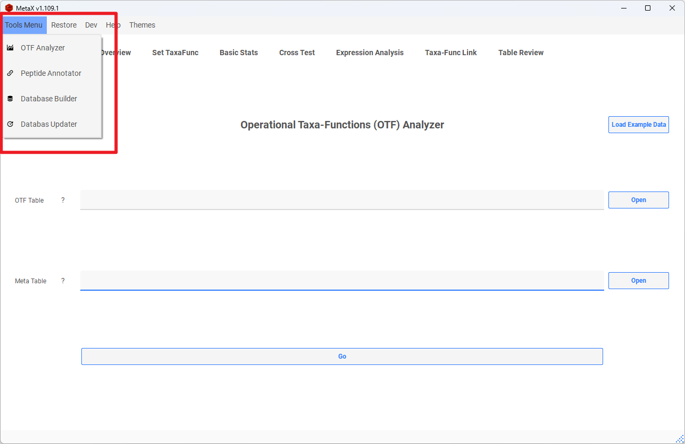

 

# Preparing Your Data

## Module 1. Database Builder

**Note:** The results from **MetaLab v2.3** MaxQuant workflow do not require database building. However, we do not recommend using these results as input to MetaX, as many peptides may be discarded.

- Build the database for the **first time** using the <u>Database Builder</u>.

  **Option 1: Build Database Using MGnify Data**

  Ensure you download the correct database type corresponding to your data.

  

  **Option 2: Build Database Using Own Data**

  1. **Annotation Table:** A TSV table (tab-separated), with the first column as protein name joined with Genome by "_", e.g., "Genome1_protein1", and other columns containing annotation information.

  

  2. **Taxa Table:** A TSV table (tab-separated), with the first column as Genome name, e.g., "Genome1", and the second column as taxa.

  **Example Annotation Table:**

  | Query               | Preferred_name | EC                | KEGG_ko             |
  | ------------------- | -------------- | ----------------- | ------------------- |
  | MGYG000000001_00696 | mfd            | -                 | ko:K03723           |
  | MGYG000000001_02838 | hxlR           | -                 | -                   |
  | MGYG000000001_01674 | ispG           | 1.17.7.1,1.17.7.3 | ko:K03526           |
  | MGYG000000001_02710 | glsA           | 3.5.1.2           | ko:K01425           |
  | MGYG000000001_01356 | mutS2          | -                 | ko:K07456           |
  | MGYG000000001_02630 | -              | -                 | -                   |
  | MGYG000000001_02418 | ackA           | 2.7.2.1           | ko:K00925           |
  | MGYG000000001_00728 | atpA           | 3.6.3.14          | ko:K02111           |
  | MGYG000000001_00695 | pth            | 3.1.1.29          | ko:K01056           |
  | MGYG000000001_02907 | -              | -                 | ko:K03086           |
  | MGYG000000001_02592 | rplC           | -                 | ko:K02906           |
  | MGYG000000001_00137 | -              | -                 | ko:K03480,ko:K03488 |

  **Example Taxa Table:**

  | Genome        | Lineage                                                      |
  | ------------- | ------------------------------------------------------------ |
  | MGYG000000001 | d_Bacteria;p_Firmicutes_A;c_Clostridia;o_Peptostreptococcales;f_Peptostreptococcaceae;g_GCA-900066495;s_GCA-900066495 sp902362365 |
  | MGYG000000002 | d_Bacteria;p_Firmicutes_A;c_Clostridia;o_Lachnospirales;f_Lachnospiraceae;g_Blautia_A;s_Blautia_A faecis |
  | MGYG000000003 | d_Bacteria;p_Bacteroidota;c_Bacteroidia;o_Bacteroidales;f_Rikenellaceae;g_Alistipes;s_Alistipes shahii |
  | MGYG000000004 | d_Bacteria;p_Firmicutes_A;c_Clostridia;o_Oscillospirales;f_Ruminococcaceae;g_Anaerotruncus;s_Anaerotruncus colihominis |
  | MGYG000000005 | d_Bacteria;p_Firmicutes_A;c_Clostridia;o_Peptostreptococcales;f_Peptostreptococcaceae;g_Terrisporobacter;s_Terrisporobacter glycolicus_A |
  | MGYG000000006 | d_Bacteria;p_Firmicutes;c_Bacilli;o_Staphylococcales;f_Staphylococcaceae;g_Staphylococcus;s_Staphylococcus xylosus |
  | MGYG000000007 | d_Bacteria;p_Firmicutes;c_Bacilli;o_Lactobacillales;f_Lactobacillaceae;g_Lactobacillus;s_Lactobacillus intestinalis |
  | MGYG000000008 | d_Bacteria;p_Firmicutes;c_Bacilli;o_Lactobacillales;f_Lactobacillaceae;g_Lactobacillus;s_Lactobacillus johnsonii |
  | MGYG000000009 | d_Bacteria;p_Firmicutes;c_Bacilli;o_Lactobacillales;f_Lactobacillaceae;g_Ligilactobacillus;s_Ligilactobacillus murinus |

## Module 2. Database Updater

The **Database Updater** allows updating the database built by the **Database Builder** or adding more annotations. This step is **<u>optional</u>**.

- Update the built database and extend annotations.

  

  **Option 1: Built-in Mode**

  We recommend some extended databases, such as [dbCAN_seq](https://bcb.unl.edu/dbCAN_seq).

  **Option 2: TSV Table**

  Extend the database by adding a new database to the database table. Ensure the column separator is a tab and the first column is the Protein name, with other columns containing function annotations.

  **Example:**

  | Protein ID          | COG        | KEGG       | ...  |
  | ------------------- | ---------- | ---------- | ---- |
  | MGYG000000001_02630 | Function 1 | Function 1 | ...  |
  | MGYG000000001_01475 | Function 2 | Function 1 | ...  |
  | MGYG000000001_01539 | Function 3 | Function 1 | ...  |

## Module 3. Peptide Annotator

### 1. Results from MAG Workflow

The peptide results use Metagenome-assembled genomes (MAGs) as the reference database for protein searches, e.g., MetaLab-MAG, MetaLab-DIA and other workflows wich using MAG databases like MGnify or customized MAGs Database.

- Annotate the peptide to Operational Taxa-Functions (OTF) Table before analysis using the <u>Peptide Annotator</u>.

  

  **Required:**

  - **Database**: The database created by <u>Database Builder</u>

  - **Peptide Table**:

    - *Option 1*: From MetaLab-MAG results (final_peptides.tsv)

    - *Option 2*: Create it manually, with the first column as the ID (e.g., peptide sequence) and the second column as the proteins ID of MGnify (e.g., MGYG000003683_00301; MGYG000001490_01143) or your database, and other columns as the intensity of each sample.

    **Example:**

    | Sequence                            | Proteins                                                     | Intensity_V1_01 | Intensity_V1_02 | Intensity_V1_03 | Intensity_V1_04 |
    | ----------------------------------- | ------------------------------------------------------------ | --------------- | --------------- | --------------- | --------------- |
    | (Acetyl)KGGVEPQSETVWR               | MGYG000002716_01681;MGYG000000195_00452;MGYG000001616_00519;MGYG000002258_01582;MGYG000001300_00281;MGYG000002926_00231;... | 714650          | 0               | 0               | 0               |
    | (Acetyl)KVIPELNGK                   | MGYG000003589_01892;MGYG000001560_01812;MGYG000001789_00244;... | 0               | 0               | 0               | 0               |
    | (Acetyl)LAELGAKAVTLSGPDGYIYDPDGITTK | MGYG000001199_02893                                          | 0               | 0               | 0               | 0               |
    | (Acetyl)LLTGLPDAYGR                 | MGYG000001757_01206;MGYG000004547_02135;MGYG000001283_00124;MGYG000004758_00803;MGYG000002486_00845;MGYG000000271_01269 | 0               | 307519          | 0               | 0               |
    | (Acetyl)MDFTLDKK                    | MGYG000000076_01275;MGYG000003694_00879;MGYG000000312_02425;MGYG000000271_02102;MGYG000004271_00233;MGYG000002517_00542;MGYG000000489_01025 | 306231          | 0               | 0               | 1214497         |

  - **Output Save Path**: The location to save the result table.

  - **LCA Threshold**: Find the LCA with the proportion threshold for each peptide. The default is 1.00 (100%).

    

### 2. Results from MaxQuant Workflow

The peptide results from **MetaLab 2.3** MaxQuant workflow.

- Select the **MetaLab** result folder, which contains the **maxquant_search** folder.

  

- The **Peptide Annotator** will automatically find the **peptides_report.txt**, **BuiltIn.pepTaxa.csv**, and **functions.tsv** in the **maxquant_search** folder. Alternatively, you can select the files manually.

  - Select **OTFs Save To** to set the location to save the result table.

  

 

# Exploring Data with MetaX

## Module 4. OTF Analyzer

After obtaining the **Operational Taxa-Functions (OTF) Table** using the <u>**Peptide Annotator**</u>, you can perform downstream analysis with the **<u>OTF Analyzer</u>**.

## 1. Data Preparation

**OTFs (Operational Taxa-Functions) Table:** Obtained from the <u>Peptide Annotator</u> module.

**Meta Table:** The first column is sample names, and the other columns represent different groups. If no meta table is provided, meta info will be generated automatically: (1) all samples are in the same group; (2) each sample is a separate group.

**Example Meta Table:**

| samples  | Individuals | Treatment | Sweetener |
| -------- | ----------- | --------- | --------- |
| sample_1 | V1          | Treatment | XYL       |
| sample_2 | V1          | Treatment | XYL       |
| sample_3 | V1          | Treatment | XYL       |
| sample_4 | V1          | Control   | PBS       |
| sample_5 | V1          | Control   | PBS       |
| sample_6 | V1          | Control   | PBS       |

You can load example data by **clicking the button**.

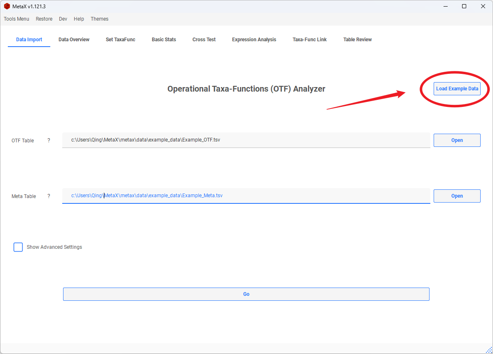

Then, click **Go** to start the analysis.

## 2. Data Overview

The Data Overview provides basic information about your data, such as the number of taxa, functions, and proportions.

- Set the threshold for linked peptides and the differences between them to plot figures.

- Select different functions to plot the proportion distribution.

- Filter out samples for downstream analysis.

## 3. Set TaxaFunc

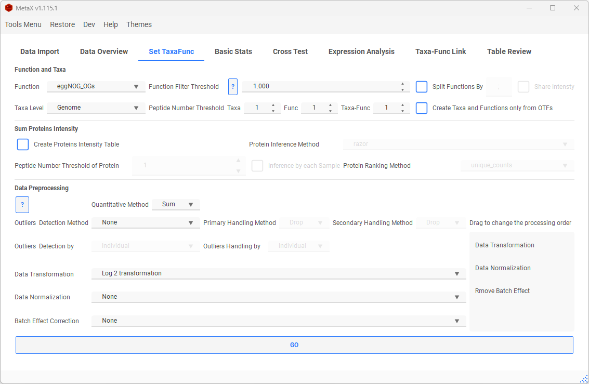

### Data Selection

- **Function:** Select a function for downstream analysis (**None** in the list means no function is selected, focusing only on peptides and taxa).

- **Function Filter Threshold:** If a specific function within a protein group of a peptide has the highest proportion, it will be considered the representative function for that peptide. The default threshold is 1.00 (100%).

- **Taxa Level:** Select a taxa level for downstream analysis (**Life** in the list means no filtering by any taxa, the follow analysis focus on functions).

- **Split Function:** Split the annotations with multi-functions.

  - | KO                  | Intensity |
    | ------------------- | --------- |
    | ko:K00625,ko:K13788 | 10        |

    to

    | KO        | Intensity |
    | --------- | --------- |
    | ko:K00625 | 10        |
    | ko:K13788 | 10        |

    If <u>Share Intensity</u> is checked, the intensity above would given <u>5</u> to each split KO

- **Peptide Number Threshold:**  only keep the taxon (function or OTF) at least has the setting number of peptides.

- **Create Taxa and Func only from OTFs:**

  - **Without selection (checkbox not checked):**
    - <u>Taxa table:</u> Peptides are filtered based solely on taxa levels, without considering any functional categories.
    - <u>Function table:</u> Peptides are filtered solely by functional categories and thresholds, regardless of their taxa levels.
    - <u>Taxa-Function (OTFs) table:</u> Peptides are filtered by both taxa levels and functional categories simultaneously.
  - **With selection (checkbox checked):**

- All tables are filtered by both taxa levels and functional categories simultaneously.

### Sum Proteins Intensity

Click **Create Proteins Intensity Table** to sum peptides to proteins if the Protein column is in the original table.

- **Occam's Razor**, **Anti-Razor** and **Rank:** Methods available for inferring shared peptides.
  - Razor:
    1. Build a minimal set of proteins to cover all peptides.
    2. For each peptide, choose the protein with the most peptides (if multiple proteins have the same number of peptides, share intensity to them).
  - Anti-Razor:
    - All proteins share the intensity of each peptide.
  - Rank:
    1. Build the rank of proteins.
    2. Choose the protein with a higher rank for the shared peptide.
    
    
    - **Methods to Build Protein Rank:**
      - unique_counts: Use the counts of proteins inferred by unique peptides.
      - all_count: Use the counts of all proteins.
      - unique_intensity: Use the intensity of proteins inferred by unique peptides.
      - shared_intensity: Use the intensity divided by the number of shared peptides for each protein.
    

### Data preprocessing

- **Quantitative Method：**

  - **<u>Sum</u>**: Sum the peptides intensity directly to Taxa, Functions or OTFs intensity.

  - **<u>DirecteLFQ</u>**: Using DirecteLFQ to normalize the peptides and then estimate the intensity by using  *intensity traces*.

    

- **Outlier handling:**

There are several methods for detecting and handling outliers.

- Two steps will be applied:
  - <u>Outlier Detection:</u> Users can select a method to mark outlier values as NaN. Then the rows `only contain NaN values and 0` will be removed. The remaining NaN values will be handled in the next step.
  - <u>Outlier Handling:</u> Users can choose a method to fill the remaining NaN values.
  

- **Outliers Detection:**

  - **IQR:** In a group, if the value is greater than Q3+1.5\*IQR or less than Q1-1.5\*IQR, the value will be marked as NaN.
  
  - **Missing-Value:** Detect nan values in the data. If a value is nan, it will be marked as a NaN.
  
  - **Half-Zero:** This rule applies to groups of data. If more than half of the values in a group are 0, while the rest are non-zero, then the non-zero values are marked as NaN. Conversely, if less than half of the values are 0, then the zero values are marked as NaN. If the group contains an equal number of 0 and non-zero values, all values in the group are marked as NaN.
  
  - **Zero-Dominant:** This rule applies to groups of data. If more than half of the values in a group are 0, then the non-zero values are marked as NaN.
  
  - **Zero-Inflated Poisson:** This method is based on the Zero-Inflated Poisson (ZIP) model, which is a type of model that is used when the data contains a lot of zeros, more than what is expected in a standard Poisson model. In this context, the ZIP model is used to detect outliers in the data. The process involves fitting the ZIP model to the data and then predicting the data values. If the predicted value is less than 0.01, then the data point is marked as an outlier (NaN).
  
  - **Negative Binomial:** This method is based on the Negative Binomial model, which is a type of model used when the variance of the data is greater than the mean. Similar to the ZIP method, the Negative Binomial model is fitted to the data and then used to predict the data values. If the predicted value is less than 0.01, then the data point is marked as an outlier (NaN).
  - **Z-Score:** Z-score is a statistical measure that tells how far a data point is from the mean in terms of standard deviations. Outliers are often identified as points with Z-scores greater than 2.5 or less than -2.5.
  - **Mahalanobis Distance:** Mahalanobis distance measures the distance between a point and a distribution, considering the correlation among variables. Outliers can be identified as points with a Mahalanobis distance that exceeds a certain threshold.

​	<u>In all methods, You can choose detection outliers by a meta column, and a meta to handle the outliers.</u>

- **Outliers Imputation:**

  - **Drop:** Remove peptides that contain any NaN values.

  - **Original:** Remove peptides that contain any NaN values.

  - **Mean**: Outliers will be imputed by the mean.

  - **Median**: Outliers will be imputed by the median.

  - **KNN**: Outliers will be imputed by KNN (K=5). The K-Nearest Neighbors algorithm uses the mean or median of the nearest neighbours to fill in missing values.

  - **Regression**: Outliers will be imputed by using IterativeImputer with regression method. This method uses round-robin linear regression, modelling each feature with missing values as a function of other features.

  - **Multiple**: Outliers will be imputed by using IterativeImputer with multiple imputations method. It uses the IterativeImputer with a specified number (K=5) of the nearest features.

  You can choose the outliers Imputation by *each group* or by *all samples*.

- **Remove Batch Effect:**

  - Here, you can choose a group as the batch effect, then use [<u>reCombat</u>] (https://github.com/BorgwardtLab/reComBat) for handling.
- **Data Transformation:**

  - Log2, Log10, Square root transformation, Cube root transformation and box-cox.

- **Data Normalization:**

  - Standard Scaling (Z-Score), Min-Max Scaling, Pareto Scaling, Mean centring and Normalization by sum.

<u>If you use [Z-Score, Mean centring and Pareto Scaling] data normalization, the data will be given a minimum offset again to avoid negative values.</u>

- **Drag the item's name** to change the <u>**order**</u> of data preprocessing.

  

**Then, click Go to create a TaxaFunc object for analysis.**

Then we can check tables in **Table Review** part, and export it.

## 4. Basic Stats

### PCA, Correlation and Box Plot

We can select <u>**meta**</u> <u>**groups**</u> or <u>**samples**</u> (default all) to plot **PCA**, **Correlation**,  and **Box Plot** for **[Taxa, Function, Taxa-Func, Peptide table, Protein table**]

- **Setting and modifying the plot**

  - Show or hide labels in the figure by checking the checkbox **Show Labels**

  - Select **Sub Meta**  to plot with two meta

    - 

  - Change settings in the **PLOT PARAMETER** tab

    - 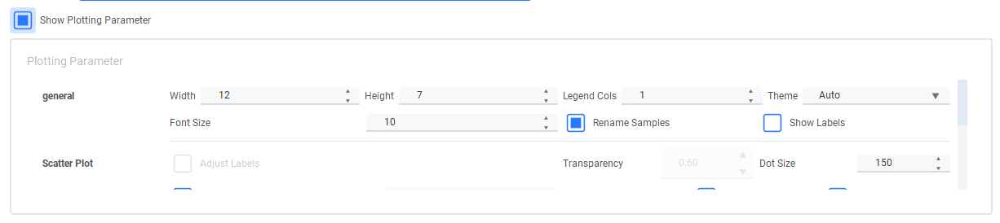

      

  - Select specific Groups **with condition**

    **e.g. :** Select PBS, BAS and others groups **only in** <u>Individual</u> <u>V1</u> 

    - 

  - Select **specific Samples** to Analysis

    - 

      

    - 

- **Number stats**

  - We can plot the bar for the number for each table by **groups** or by **samples**

  

- **Taxa Specific**

  - Alpha/Beta Diversity

    - 
    - 

  - Sunburst

    - 

  - TreeMap

    - 

  - Sankey

    - 

    

### Heatmap and Bar Plot

- **Select items(Taxa, Function, Taxa-Func and Peptide ) to plot:**
  - Add **All Taxa**, or select one we are interested in.

- **Add items to Top List:** select the top items to plot by some statistical method.

  - Clicked <u>filter with threshold</u> will filter by the padj of ANOVA and T-TEST and padj and Log2FC of DESeq2 result (setting in the corresponding page).

  

- **Add a list for ploting:**

  - Make sure one row one item

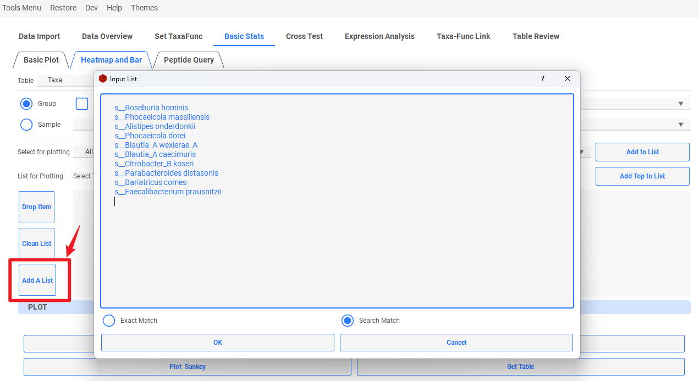

- **Setting:**

  - Change the setting fit for your data.
  - **Rename Samples**: Add group info to each sample name
  - **Rename Taxa**: Only keep the last taxonomic level to reduce to name
  - **Plot Mean**: calculate the mean of each group before plotting
    
  - **Sub Meta:** select a second meta, then combine two meta by mean for Heatmap and 3D bar plot
    - **<u>For Heatmap</u>**
      - **Theme**: The theme of the heatmap
      - **scale**: Scale method of the heatmap
      - **Show All Labels:** if show all labels in the heatmap
    - **<u>For Bar</u>**
      - **Bar Ldg**: Show the legend when plotting Bar
      - **Bar %:**  Transfer each col to percent when plotting Bar
      - 
    
  - Plot all color maps to view by right click <u>**Theme**</u>
    - 
    - 
  
- **Plot:**

  

  - **Modify** the pic to fit the window to get the **Perfect picture**:

    
    
    - 

- **Bar Plot:**

- **interactive function:**

  

  - change to line plot:

    

- 3D Bar plot

  - Plot 3D bar by selecting a **sub meta**.
  - 

### Peptide Query

- Query everything of a peptide

  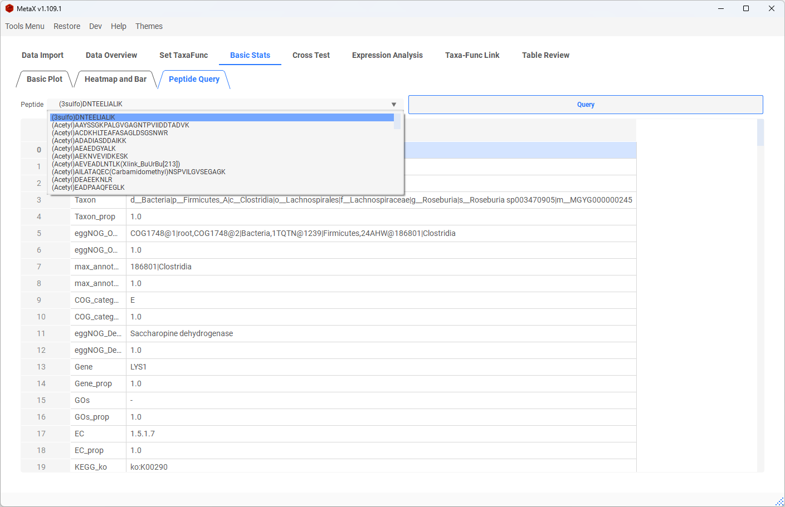

## 5. Cross Test

### T-TEST

- Select 2 group stats T-Test for  **[Taxa, Function, Taxa-Func, Peptide table and Proteins Table**]

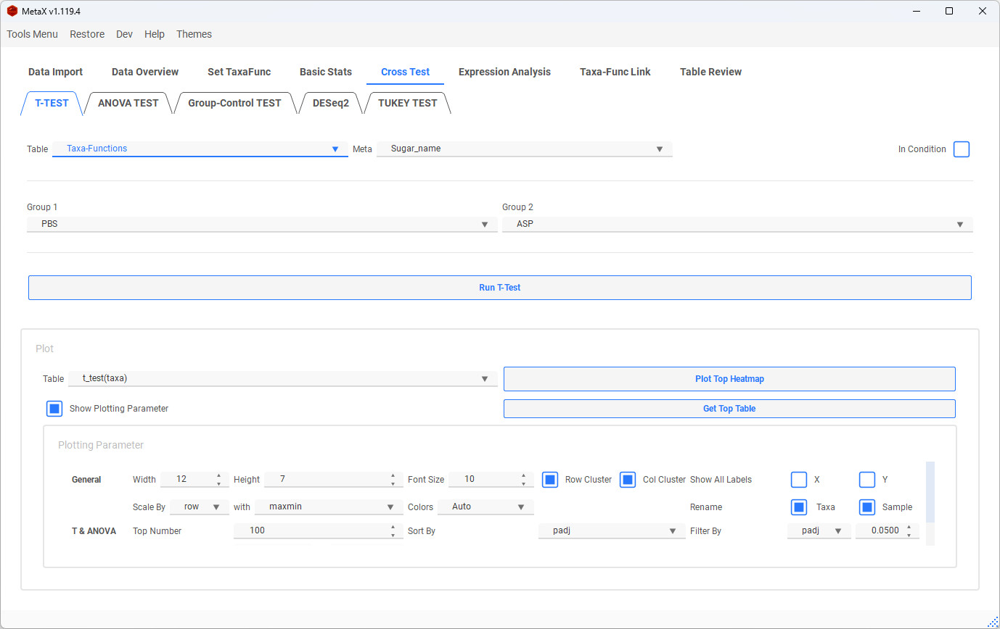

### ANOVA-TEST

- select <u>some groups</u> or <u>all groups</u> to ANOVA Test for  **[Taxa, Function, Taxa-Func and Peptide table**]

### Significant Taxa-Func

- Significant comparing enables us to find the result of **<u>The taxa between the two groups showing no significant differences, while the related functions are significantly different</u>** and function no significant but relted taxa significant.
- 

### Plot Corss Heatmap

- The **result** of the T-test and ANOVA Test will show in a new window

  

  

- Plot Heatmap for results

  - Chose a Table to plot **top differences heatmap** or get **the top table**

- 
- Taxa-Func cross heatmap:
  - The orange cells mean in the corresponding function ( X-axis) and Taxa( Y-axis) are significantly different between groups.

- Func(Taxa) Heatmap:

  - The colour shows the intensity of the significant Func(Taxa) between groups.

  

- Significant Taxa-Func Heatmap:

  - The colored tiles represent the taxa which were not significantly different between groups but the related functions were.

### Group-Control TEST

- **Dunnett's Test**

  Set a Group as **"Control"**, then compare all groups to Control

  - **Comparing in Each Condition:** Select a meta such as individual, then compare groups to control in each individual.

- **DESeq2 Test**

  Bingo! You noticed the hidden function of MetaX,  click **Help -> About -> Like** 3 times to unlock the function to compare all groups to control.

  

  - 
  - Result of Dunnett's Test:
    - T- Statistic value shown in the heatmap
  - 

### DESeq2

- Select two groups to calculate FoldChange by [<u>PyDESeq2</u>]: https://github.com/owkin/PyDESeq2

  

- Select <u>p-adjust</u>, <u>log2FC</u> to plot

  (**Ultra-Up(Down):** |log2FC| > Max log2FC)

  - Volcano:

    

  - Sankey:

    - The last node level is the functions linked to each Taxon (When plotting Taxa-Func)

    

### TUKEY_TEST

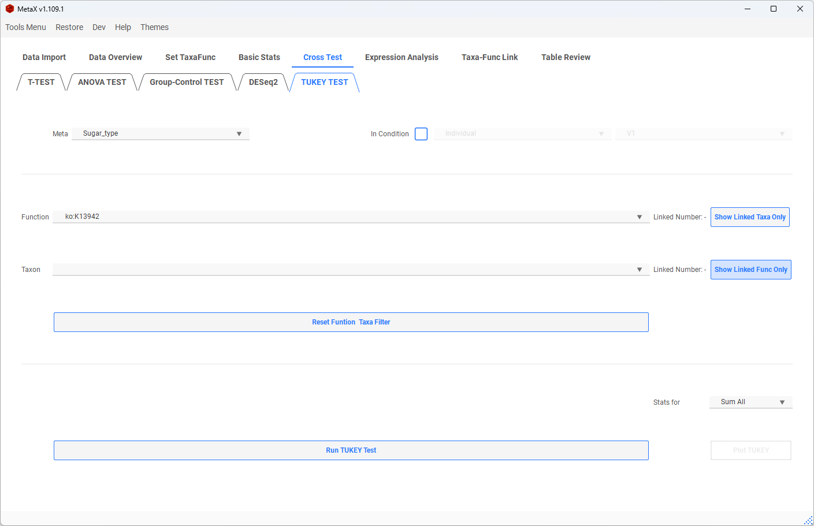

- **Select a function:** 

  - Test the significant groups in this function.

- **Select a Taxon:** 

  - Test the significant groups in this taxon.

- **Select both function and taxon:** 

  - Test the significant groups in this function and this taxon.

  

  - Show Linked Taxa Only: only shows the taxa linked with the current function in the taxa combo box.

  - Show Linked Func Only: only shows the function linked with the current taxon in the function combo box.

    ​	**Do  not forget to click <u>Reset Function Taxa List</u> to reset all items after the filtering**

  

- **Tukey result plot:**
  - The dots and lines show the difference in the mean value of the Tukey test

## 6. Expression Analysis

### Co-Expression Networks & Heatmap

- select Groups or Samples to calculate the correlation and plot the network

- Slecet table, and set the method of correlation and threshold

  

  - Add some items to the focus list (Optional)

  

- Network Plot

  - The Red dots are focus items
  - The depth of color and the width of edges represent the correlation value
  - The size of the dot indicates the number of connections

- Correlation of expression
  - 

### Expression Trends

- Add items to the list window to plot the clusters with similar trends of intensity

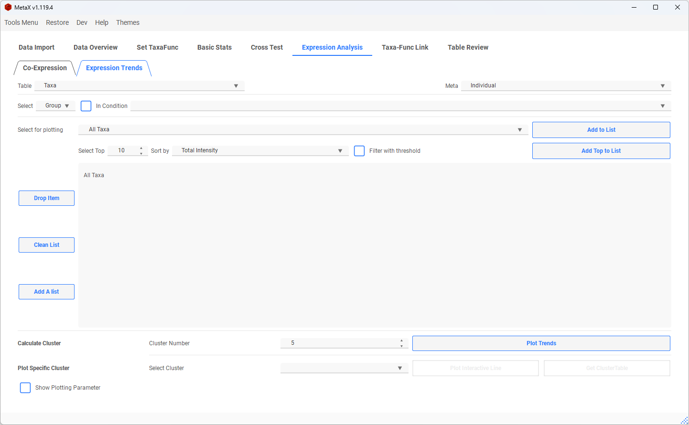

- Clusters plot (clustered by **k-means**)

  - The coloured line is the average 

  

- Select a **specific cluster** to plot <u>interactive Lines</u> or get the <u>table</u>

  - 

  - The dashed red line  is the average 

    

    

## 7. Taxa-Func Link

### Taxa-Func Link Plot

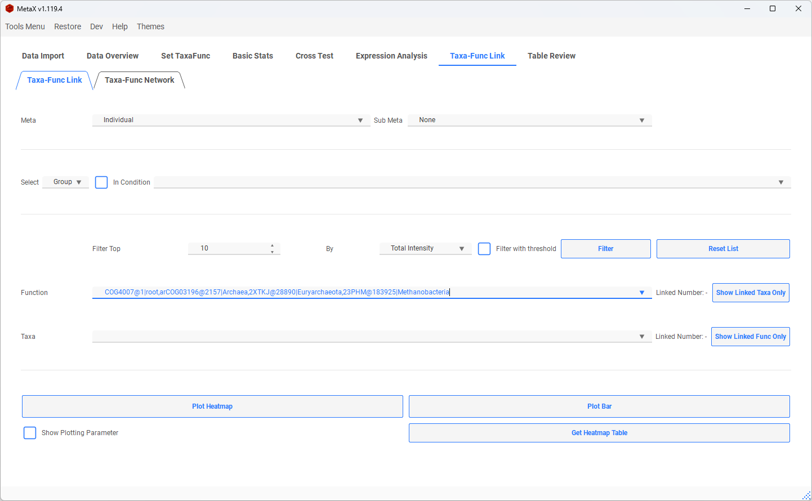

- Check all taxa in one function (or Check all functions in a taxon)

  - select **a function**, and click the button **<u>Show Linked Taxa Only</u>**
    - **Linked Number**: The number shows how many taxa are linked in this function
    - **The number starts with Taxa**: The number shows how many peptides are in this Taxa-Func

  

- Filter items of the Taxa and Func list

  

  

- Plot Heatmap or Bar

  - Select some groups (Default all) to get **the intensity of each taxon of this function**

    

- Plot **peptides** in <u>one Function of a Taxon</u>

  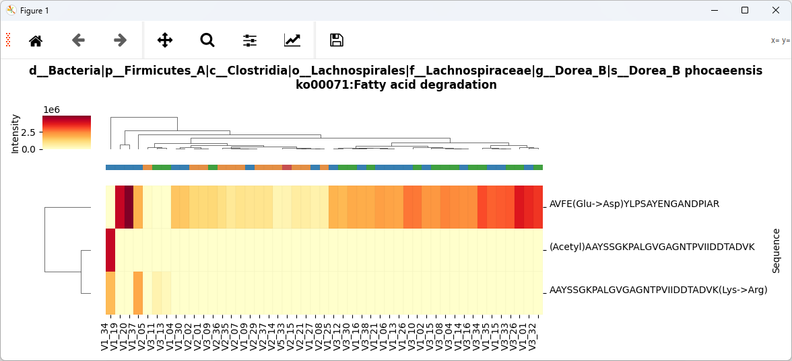

  

- Switch Bar to Stacked or not ( Line)

  

- Change Bar plot to Lines

  

### Taxa-Func Network

- Select some groups or samples (default all)
- add some taxa, func or taxa-func to focus the window  (Optional)

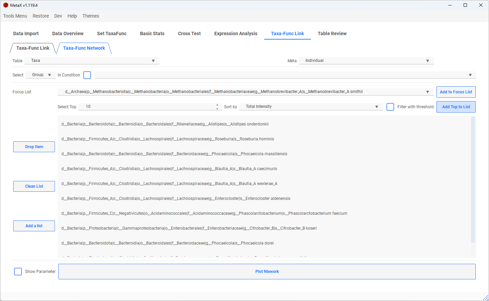

- Plot list only
  - **Plot List Only:** Show the items only in the list and the items linked to them
  - **Without Links:** Only show the items in the focus list
    - 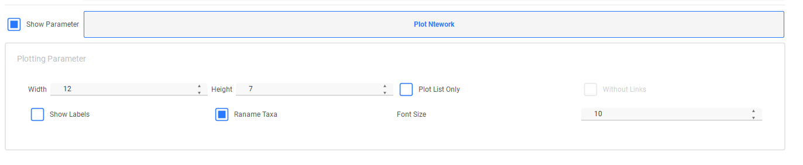
  
- Network plot
  - The yellow dots are taxa, and the grey dots are functions, the size of the dots presents the intensity
  - The red dots are the taxa we focused on
  - The green dots are the functions we focused on
- More parameters can be set in **Dev**->**Settings**->**Others** (e.g. Nodes Shape, color, Line Style)

## 8. Restore Last TaxaFunc Object

- Once you create TaxaFunc, the <u>TaxaFunc Object</u> will save automatically, and you can restore it next time.
- Also, we can export the current MetaX to a file and reload it again.
  - 

# Developer Tools

- **Export Log**

  - You can export the log file for debugging or reporting the issue.
  - 

- **Show or Hide the Console**

  - 

- **Any Table Mode**

  - <u>Any Table Mode</u> enables us to use **any matrix** for basic statistical analysis in MetaX.

  - 

- Settings

  - Check the box of **Auto Check Update** to enable or disable check update when launching
  - Change to update from the **stable version** or **beta version** by settings
  - 
  - Other Options Settings
  - 
  
  

# Enjoy MetaX

If you have any issues or suggestions, please New issue in my [GitHub](https://github.com/byemaxx/MetaX).
